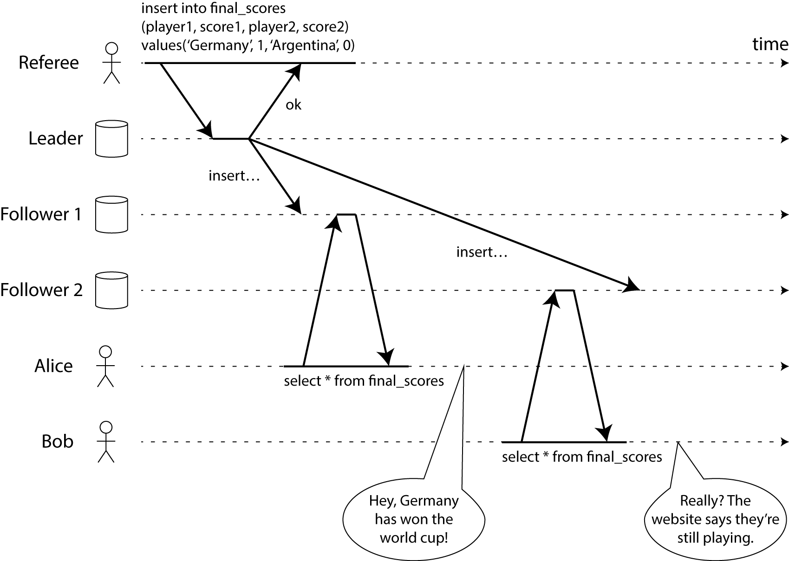
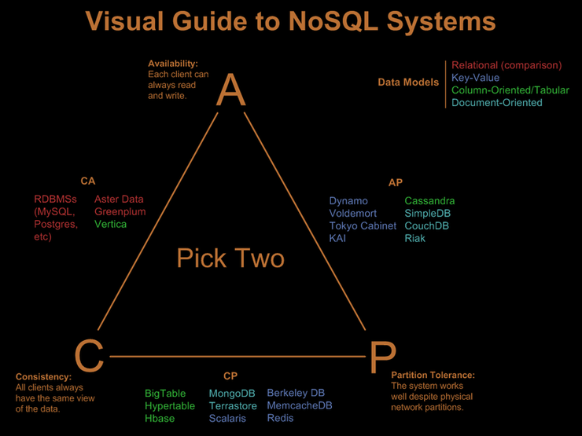

# CAP theory

CAP 이론이란, 간단히 말하자면 분산 시스템에서 일관성(Consistency), 가용성(Availbility), 분할 용인(Partition tolerance)라는 세가지 조건을 모두 만족하는 것은 불가능하므로, 세 가지 중 두가지를 택하라는 것으로 알려져있다.

> 사실 CAP 이론 자체가 제대로 이해하기 쉽지 않아 이에 대해 오해들도 많다. 또한 이 CAP 이론자체에 오류가 있다는 비판들도 많다.

## Concept

우선, CAP 이론의 각 속성들을 하나씩 설명한다.

### Consistency

CAP 이론에서의 Consistency는 우리가 흔히 아는 `ACID` 의 Consistency와는 전혀 다른것이다. 여기서 많은 사람들이 헷갈린다. Consistency라는 용어보다 Linearizability라는 용어가 이해가 쉬울수 있다. 즉, A 라는 작업이 성공적으로 완료된후, B 작업이 실행되면, B 작업은 반드시 A 작업이 완료되었을 때와 같은 상태이거나 더 새로운 상태이어야 한다. 아래의 그림을 보면, 이해가 쉬울 것이다.

>  그림1. consistency - [그림 출처](https://martin.kleppmann.com/2015/05/11/please-stop-calling-databases-cp-or-ap.html)

위의 그림에서는 Consistency을 만족하지 못하는 것이다. Referee는 최종 스코어를 등록하여 경기가 끝났다는 것을 기록한 뒤에, Alice와 Bob이 결과를 요청했는데 서로 다른 결과를 받게 됨으로써 일관성이 깨졌다고 할 수 있습니다.

즉, CAP 이론의 일관성은 한 개의 노드에서 작동하는 것처럼 보이게 모든 노드에서 같은 시간에 같은 응답을 보내야한다는 의미입니다.

### Availability

가용성(Availability)은 용어에서 추측할수 있듯이, 모든 요청(read, write)에 대하여 정상 응답해야한다는 속성입니다. (cf. 사실 우리가 흔히 듣는 HA의 availability와도 차이가 있다.)

즉, 분산시스템에서 가용성은 클러스터의 노드 일부에서 장애가 발생하더라고 항상 100% 작동하도록 보장해야한다는 것입니다.

### Partition Tolerance

Partition Tolerance는 한국어로 번역하자면, 분할 내성(?) 정도로 해석할 수 있는데 무슨 의미인지 와닿지 않는다. 쉽게 얘기하자면, 네트워크가 파티셔닝되었을때 정상 동작해야한다는 것입니다. 즉, 분산시스템에서 네트워크은 한 노드에서 다른 노드로 전송되는 메시지가 유실되더라도 정상동작 해야한다라는 속성이다.

## CAP 이론의 실제

CAP 이론을 살펴보면 C,A,P 가 모두 분산시스템의 특성에 대한 것으로 보이지만 사실은 그렇지 않다. 세 가지 특성중 두가지만 고를 수 있다고 하는데 P 를 포기하고 CA를 선택할수 있는 것처럼 보인다. 하지만, 실제 분산시스템에서는 P를 빼놓을 수는 없다.

P를 배제하고 가려면 절대로 장애가 나지 않는 네트워크라는 것인데 이는 불가능하다. 따라서 분산시스템에서는 P를 반드시 가져가야한다.

> 그림2. network parition - [그림 출처](https://martin.kleppmann.com/2015/05/11/please-stop-calling-databases-cp-or-ap.html)

그럼 노드를 연결하는 네트워크가 중단되었다고 가정하자.

이때 우리는 두가지 중 하나를 선택할 수 있다.

1. 애플리케이션은 계속해서 데이터베이스 쓸 수 있으므로, 두 데이터 센터 모두에서 완전히 사용할 수 있다. 하지만, 네트워크가 단절되어 한 데이터센터에 반영되는 기록은 다른쪽에는 반영되지 않는다. 따라서, 일관성을 가져갈 수 없다.
2. 일관성을 잃지 않으려면, 하나의 데이터 센터에서 모든 읽기 및 쓰기를 수행해야한다. 따라서 ,다른 데이터베이스는 사용을 중지해야한다. 이는 가용성을 포기하는 것이다.

이것이 기본적인 CAP 이론이다.

---

위의 그림은 CAP 이론이라하면, 많이 접하게 되는 그림이다. 하지만, 실상은 다르다.

RDBMS는 CA라 분류한다. 하나의 인스턴스로 운영되는 RDBMS의 경우에는 네트워크로 연결되어 있지 않으므로 이렇게 분류하는 것이 맞는것처럼 보인다. 하지만, CAP 이론 자체가 분산시스템이 전제조건이므로 RDBMS에 CAP를 적용하는 것이 맞지 않을 수 있다. (cf. RDBMS는 ACID에 맞춰서 나온것이지 분산환경을 고려하여 나온것이 아니다.) 또한 클러스터링 방법에 따라 다양하게 변할수도 있다.(이것은 NoSQL도 마찬가지..)

## 결론

CAP 이론은 사실 완벽한 이론은 아니다라는 주장이 많다. 완벽하게 두개만을 선택하여, CP, AP라고 명확하게 얘기하기도 쉽지않다. 다만, 이러한 이론이 있고 분산 시스템에서는 어떠한 특성이 있는지 정도는 파악하는데 도움이 될것이다.

그리고 CAP 이론을 보강하여 나온 PACELC 이라는 새로운 이론도 있으니 참고해보면 좋을듯 하다.

### 참고

- https://martin.kleppmann.com/2015/05/11/please-stop-calling-databases-cp-or-ap.html
- https://codahale.com/you-cant-sacrifice-partition-tolerance/
- http://eincs.com/2013/07/misleading-and-truth-of-cap-theorem/

